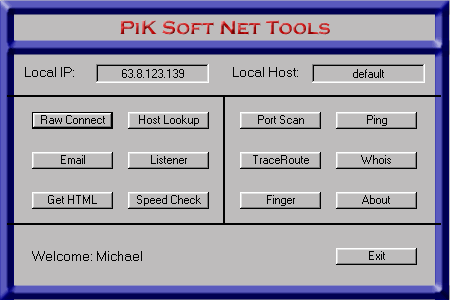



## Net Tools\!\!\!

### Description

Net Tools by PiK Soft has 12 differnt net tools including: Raw Connect, SMTP Email, Finger, Get HTML, Listen, Host Lookup, Ping, Port Scan, Speed Check, Trace Route, and Whois!!! It even has shareware protection built right in. You have to check out this code, if you dont you'll regret it!
 
### More Info
 

             |
---                |---
**Submitted On**   |2000-06-12 18:52:32
**By**             |[Pik Soft Inc\.](https://github.com/Planet-Source-Code/PSCIndex/blob/master/ByAuthor/pik-soft-inc.md)
**Level**          |Intermediate
**User Rating**    |4.9 (253 globes from 52 users)
**Compatibility**  |VB 5\.0, VB 6\.0
**Category**       |[Complete Applications](https://github.com/Planet-Source-Code/PSCIndex/blob/master/ByCategory/complete-applications__1-27.md)
**World**          |[Visual Basic](https://github.com/Planet-Source-Code/PSCIndex/blob/master/ByWorld/visual-basic.md)
**Archive File**   |[CODE\_UPLOAD68706182000\.zip](https://github.com/Planet-Source-Code/pik-soft-inc-net-tools__1-9016/archive/master.zip)

